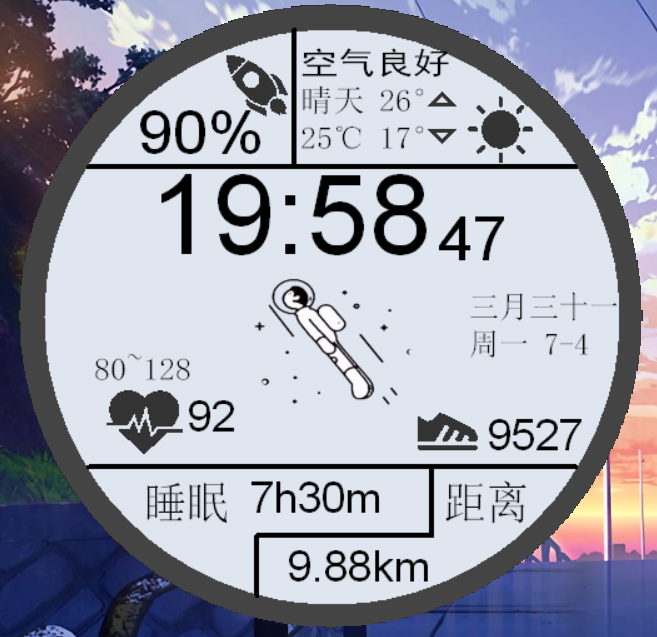

# -HuaWei旋转太空人表盘-
利用VS2017编程环境实现华为太空人表盘

可以先看看实现效果
  
其中的太空人图案是可以一直旋转的
****
环境需求：  
1.VS2017及以上版本  
         2.VS中需要已经安装EasyX(如果没有，请自行百度安装)  
****
使用说明：  
1.直接下载整个压缩包到本地后解压，只有HuaWeiWatchOffical文件夹是需要用到的工程文件  
2.若想看看代码、调试本程序，可在完成环境需求配置后打开HuaWeiWatchOffical文件夹中的HuaWeiWatchOffical.sln  
3.也可以直接运行程序，地址为HuaWeiWatchOffical/MainProgram/MainProgram.exe  
****
其他说明：  
在MainProgram文件夹中  
1. HUAWEI.cpp是本程序运行的代码主体  
2. tool.hpp是自己编写的、程序运行依赖的头文件  
3. images文件夹中存放的是贴图和音频资源
